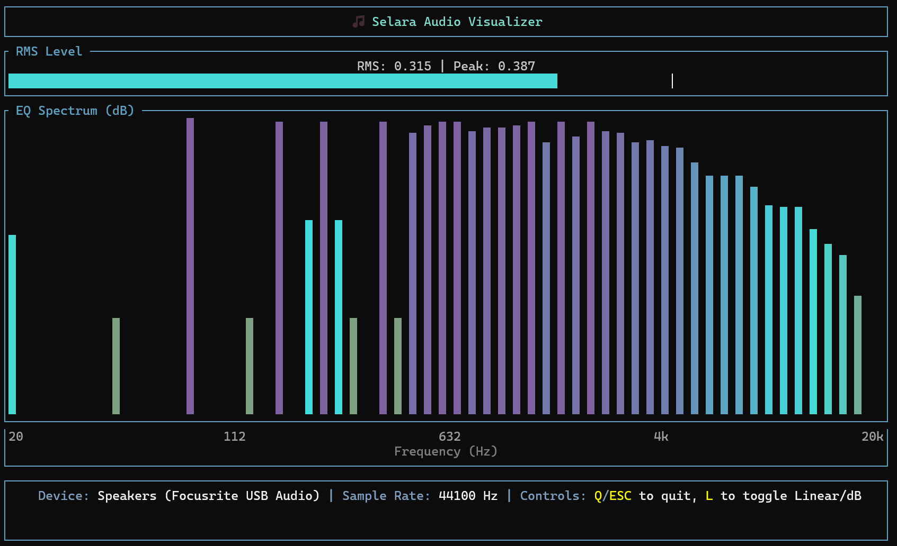

# Selara

A real-time audio spectrum analyzer and visualizer built in Rust with a terminal-based user interface.



## What is Selara?

Selara is a cross-platform audio visualization tool that captures system audio output and displays it as both a real-time spectrum analyzer and RMS level meter. It provides a clean, responsive terminal interface for monitoring audio activity.

## Features

- **Real-time spectrum analysis** with FFT-based frequency band visualization
- **RMS level monitoring** with peak hold functionality
- **Dual display modes**: dB scale and linear scale
- **Cross-platform audio capture** using system default output device
- **Responsive terminal UI** built with Ratatui
- **Low latency** audio processing with configurable frame rates

## How it Works

Selara uses several key components:

1. **Audio Capture**: Uses `cpal` to create a loopback stream from the system's default output device
2. **Signal Processing**: Performs real-time FFT analysis using `realfft` with windowing and frequency band mapping
3. **Visualization**: Renders spectrum data and level meters in a terminal interface using `ratatui`
4. **Threading**: Separates audio capture, FFT processing, and UI rendering for optimal performance

## Requirements

- Rust 2024 edition
- Audio output device (captures system audio playback)

## Installation

```bash
git clone <repository-url>
cd selara
cargo build --release
```

## Usage

```bash
cargo run
```

### Controls

- **L**: Toggle between dB and linear display modes
- **q/ESC** or **Ctrl+C**: Quit the application

## Contributing

We welcome contributions! Here's how to get started:

### Development Setup

1. Fork and clone the repository
2. Install Rust (latest stable version recommended)
3. Run `cargo build` to verify everything compiles
4. Make your changes
5. Test with `cargo test` (if tests are available)
6. Submit a pull request

### Code Structure

- `src/main.rs` - Application entry point and main loop
- `src/audio.rs` - Audio capture and FFT spectrum analysis
- `src/ui.rs` - Terminal UI rendering and event handling
- `src/types.rs` - Shared data structures

### Contribution Guidelines

- Follow standard Rust formatting (`cargo fmt`)
- Ensure code compiles without warnings
- Write clear commit messages
- Test your changes on different platforms when possible
- Keep PRs focused on a single feature or fix

## License

This project is licensed under the MIT License - see the [LICENSE](LICENSE) file for details.

## Dependencies

- `cpal` - Cross-platform audio I/O
- `ratatui` - Terminal user interface framework
- `crossterm` - Cross-platform terminal manipulation
- `realfft` - Real-valued FFT implementation
- `crossbeam-channel` - Multi-producer multi-consumer channels
- `anyhow` - Error handling
- `ctrlc` - Cross-platform Ctrl-C handling
